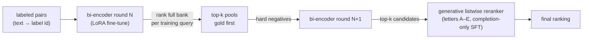

<p align="center">
  
</p>

<div align="center">

[](https://github.com/DaoyuanLi2816/labelbank/actions)
[](https://pypi.org/project/labelbank/)

[](LICENSE)
[](https://www.kaggle.com/certification/competitions/distiller/eedi-mining-misconceptions-in-mathematics)

</div>

`labelbank` is the generalized core of a **silver-medal (top 5%) solution** to Kaggle's [Eedi — Mining Misconceptions in Mathematics](https://www.kaggle.com/c/eedi-mining-misconceptions-in-mathematics), extracted into a small, tested library you can run on **your own label catalog with any Hugging Face backbone**. The exact competition artifacts are preserved untouched in [`competition/`](competition/README.md), and golden tests pin the library's default behavior to the medal-winning code **byte for byte**.

Use it when your problem looks like this: *given a piece of free text, find the matching entry in a fixed catalog of labels* — a few hundred to a few tens of thousands of entries that all look frustratingly similar. Support tickets → known-issue KB, error logs → root-cause catalog, symptoms → diagnosis codes, content → policy categories, student mistakes → misconception taxonomies (the original task: 2,587 fine-grained math misconceptions).

## Why not just an off-the-shelf embedding model?

Generic embedders retrieve "something related". In a fine-grained bank, related isn't enough — *"ignores order of operations"* and *"evaluates left to right"* are nearly identical sentences and different labels. Three design choices close that gap, and they are exactly what this library packages:

**1. No in-batch negatives — mined pools instead.**
Standard contrastive recipes use other in-batch examples as negatives. In a closed bank that's poison: another query's positive is often a *sibling label* of your gold (a false negative), and random negatives are trivially easy. `labelbank` trains on explicit per-query pools — `[gold, hard negatives…]` — with cross-entropy over the group ([`no_in_batch_neg_loss`](src/labelbank/losses.py), temperature 0.01).

**2. The hard negatives come from the model itself.**
Train round *N* → rank the whole bank for every training query → take each query's own top-k as round *N+1*'s negative pool, gold forced to the front ([`gold_first_pool`](src/labelbank/mining.py)). A self-bootstrapping curriculum: every round, the negatives are precisely the mistakes the current model still makes. This loop was decisive for the medal.



**3. A generative listwise reranker with no position prior.**
The retriever's top-k candidates are inlined into one prompt as lettered options; a causal LLM is fine-tuned (completion-only) to answer the letter. The gold's position is **shuffled at training time** — the reranker must judge content, not slot — and at inference the next-token logits over `A…E` re-order the candidates ([`ListwiseReranker`](src/labelbank/reranker.py)).

## Install

```bash
pip install labelbank              # core: metrics, mining, formatting, data (no torch)
pip install labelbank[retrieve]    # + bi-encoder retrieval (torch, transformers, peft)
pip install labelbank[rerank]      # + the generative listwise reranker (adds trl)
pip install labelbank[train]       # everything needed to train both stages
```

## 60 seconds

```python
from labelbank import LabelBank, BiEncoderRetriever, gold_first_pool

# 1. Your closed catalog, and some labeled (text -> label id) pairs.
bank = LabelBank.from_csv("catalog.csv", id_col="LabelId", text_col="LabelText")
queries = ["my failing log line…", "another report…"]   # free text
gold_ids = [1042, 17]                                    # matching catalog ids

# 2. Retrieve with any HF backbone (last-token pooling + L2 norm).
retriever = BiEncoderRetriever.from_pretrained(
    "Qwen/Qwen2.5-0.5B-Instruct", trainable=True,
    query_prefix="<instruct>Match the text to the best catalog entry.\n<query>",
)
ranked = retriever.retrieve(queries, bank, top_k=25)

# 3. Mine hard negatives from the model's own rankings, then retrain.
pools = [gold_first_pool(r, g, top_k=25) for r, g in zip(ranked, gold_ids)]

from labelbank import RetrieverTrainConfig, train_retriever
train_retriever(retriever, queries, [bank.texts_of(p) for p in pools],
                RetrieverTrainConfig(epochs=1, temperature=0.01))

# 4. Evaluate against the whole bank.
metrics = retriever.evaluate(queries, gold_ids, bank)   # map@25 + recall@{1,10,25,50,100}
```

Rerank the top-5 with a generative judge:

```python
from labelbank import build_training_rows, ListwiseReranker

rows = build_training_rows(queries, candidate_texts, gold_texts, k=5)   # gold position shuffled
reranker = ListwiseReranker.from_pretrained("Qwen/Qwen2.5-0.5B-Instruct")
reranker.train(rows, output_dir="out/reranker", lora={"r": 16})
order = reranker.rerank(query_text, candidate_texts)                     # letter-logit reorder
```

Or run the whole loop — zero-shot eval → rank the bank → mine gold-first pools → retrain → re-evaluate, for `mining_rounds` rounds — from one YAML:

```bash
python -m labelbank.run --cfg examples/configs/quickstart.yaml             # 0.5B, one consumer GPU
python -m labelbank.run --cfg examples/configs/reproduce_competition.yaml  # the medal setup (32B + NF4)
```

The retriever stage writes the adapter, per-split `rankings.parquet` and `metrics.json` to `output_dir`; the reranker stage (`stage: reranker`) consumes that parquet and trains the listwise judge on it.

## Measured: do mined negatives beat random ones?

The library's central claim, measured end to end through its public API on a public dataset — [banking77](https://huggingface.co/datasets/PolyAI/banking77) (a real closed bank of 77 customer intents), Qwen2.5-0.5B-Instruct + LoRA bi-encoder, 2,000 training pairs, 1,000 held-out test queries, pools of 8, one epoch per arm, one RTX 4080, ~1 h ([`examples/mined_negatives_experiment.py`](examples/mined_negatives_experiment.py)):

| arm (identical budgets) | MAP@25 | R@1 | R@3 | R@5 | R@10 |
|---|---|---|---|---|---|
| zero-shot backbone | 0.069 | 1.9% | 6.0% | 9.7% | 17.2% |
| random negatives (bootstrap round) | 0.788 | 67.6% | 87.8% | 94.5% | 97.6% |
| **+ self-mined, round 1** | **0.838** | **76.2%** | 89.6% | 93.3% | 97.5% |
| + self-mined, round 2 | 0.839 | 75.7% | **90.5%** | **95.0%** | **97.9%** |

Mining is worth **+5.0 MAP and +8.6 points of R@1** over random negatives at the same budget — and the gain concentrates exactly where fine-grained banks hurt: top-1, where sibling labels collide (R@10 is saturated for both). Round 2 plateaus on this small bank; the competition iterated rounds over a 2,587-entry bank (next section).

One honest caveat the ablation makes measurable: **hard negatives are only as good as the model that mines them.** Mining round 1 from the *zero-shot* model's rankings instead of the bootstrap model's collapses to MAP **0.430** — far below plain random negatives. That is why the pipeline (and the competition protocol preserved in [`competition/`](competition/README.md)) trains a bootstrap round first and mines from it. Reproduce both:

```bash
pip install -e .[retrieve] datasets
python examples/mined_negatives_experiment.py               # bootstrap protocol (table above)
python examples/mined_negatives_experiment.py --cold-start  # the ablation: mine from zero-shot
```

## Measured: the competition run

Numbers from the preserved training logs ([`competition/stage1_train.log`](competition/stage1_train.log)) — retriever stage, Qwen2.5-32B-Instruct + LoRA over a 2,587-entry bank, scored on held-out fold:

| metric | value |
|---|---|
| MAP@25 | **0.4238** |
| Recall@1 | 0.3017 |
| Recall@10 | 0.6906 |
| Recall@25 | 0.8126 |
| Recall@50 | 0.8978 |
| Recall@100 | 0.9391 |

With the listwise reranker on top, the full two-stage system scored **0.50 on the private leaderboard — silver medal, top 5%**. For intuition: Recall@25 of 0.81 means the retriever alone puts the right label among 25 candidates four times out of five — out of 2,587 that all describe subtly different math mistakes.

## How it relates to existing tools

| | sentence-transformers / BGE | RAG over a corpus | `labelbank` |
|---|---|---|---|
| Target | open-ended similarity | open document collection | **closed catalog** (can re-embed every eval) |
| Negatives | in-batch by default | n/a | explicit mined pools, no in-batch |
| Mining loop | bring your own | n/a | built in, gold-first, iterative |
| Reranker | cross-encoder (pointwise) | LLM reads retrieved docs | generative **listwise** letters, position-shuffled |
| Backbone | encoder models | any | any HF causal model as bi-encoder (last-token pool, LoRA, 4-bit) |

If you need general-purpose embeddings, use sentence-transformers. If your labels are a *fixed, fine-grained catalog* and generic embeddings keep confusing siblings, this is the recipe that medaled on exactly that problem.

## Provenance & validation

- The competition scripts, configs, training logs, inference notebook, certificate and the full original write-up are preserved verbatim in [`competition/`](competition/README.md).
- Golden tests pin the library to the medal-winning code: the contrastive loss, last-token pooling, hard-negative pool construction, both prompt templates, and the Eedi data pipeline are each fuzz-tested against verbatim copies of the originals ([`tests/reference_impl.py`](tests/reference_impl.py)) and assert **identical output** — the library *is* the competition code, not a reimplementation of it.
- Final result: **silver medal (top 5%)**, private LB 0.50 ([certificate](https://www.kaggle.com/certification/competitions/distiller/eedi-mining-misconceptions-in-mathematics)).

<p align="center">
  <a href="https://www.kaggle.com/certification/competitions/distiller/eedi-mining-misconceptions-in-mathematics">
    
  </a>
</p>

## Citation

```bibtex
@misc{li2024labelbank,
  author = {Daoyuan Li},
  title  = {labelbank: retrieval and listwise reranking over closed label banks with self-mined hard negatives},
  year   = {2024},
  url    = {https://github.com/DaoyuanLi2816/labelbank},
  note   = {Generalized from a silver-medal solution, Kaggle Eedi — Mining Misconceptions in Mathematics}
}
```

## License

MIT — see [LICENSE](LICENSE).

## Author

Daoyuan Li — [Kaggle (distiller)](https://www.kaggle.com/distiller) · lidaoyuan2816@gmail.com
